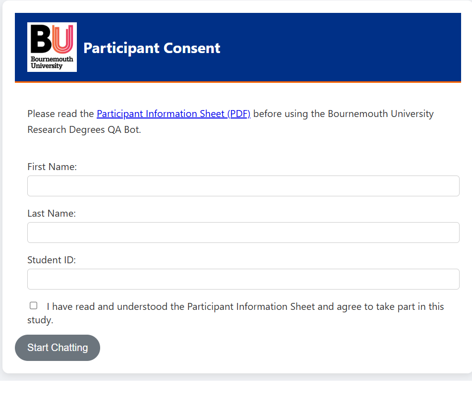
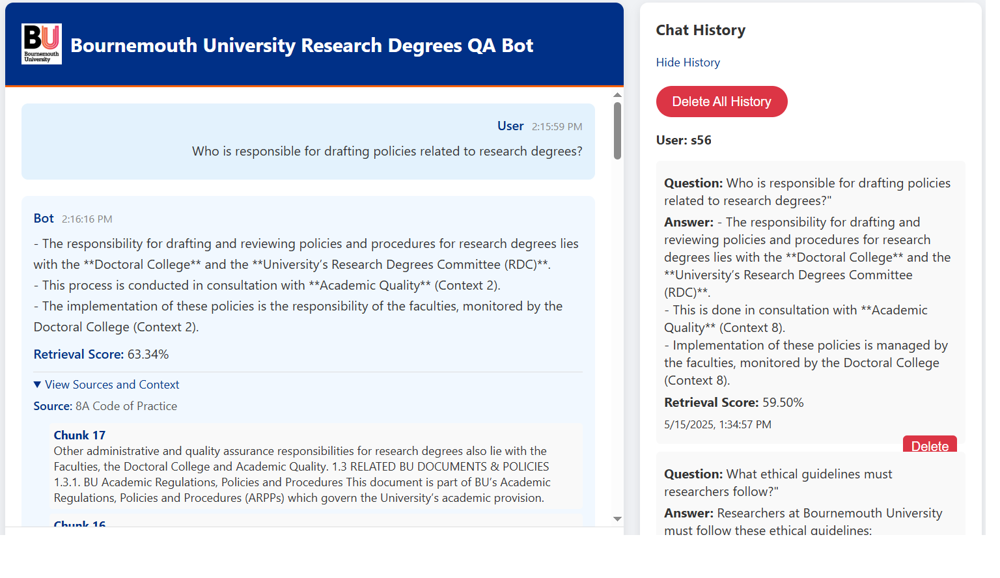
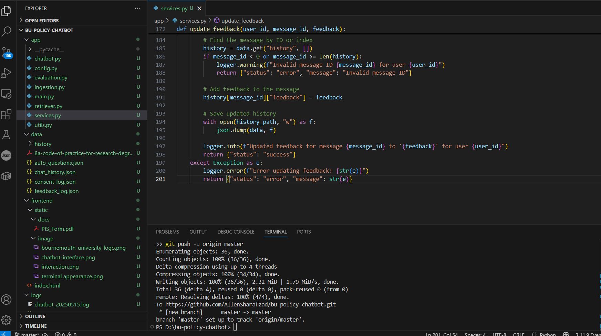

# Bournemouth University Research Degrees QA Bot

This project is a web-based chatbot designed to assist users in navigating Bournemouth University's research degree policies using natural language queries. It includes chat history tracking, feedback collection, and an evaluation pipeline.





## Features

- Natural language Q&A chatbot using OpenAI and Pinecone
- Custom document ingestion and semantic search
- Chat history per user with session tracking
- Star ratings and thumbs up/down feedback
- Consent capture with user profile tracking
- RAG-based evaluation metrics and BERTScore analysis

## Setup

### 1. Clone the repository

```bash
git clone https://github.com/AllenSharafzad/bu-policy-chatbot.git
cd bu-policy-chatbot
```

### 2. Create and activate a virtual environment

```bash
python -m venv venv
source venv/bin/activate  # On Windows use `venv\Scripts\activate`
```

### 3. Install dependencies

```bash
pip install -r requirements.txt
```

### 4. Set up environment variables

Create a `.env` file in the root directory with the following:

```env
OPENAI_API_KEY=your_openai_key
PINECONE_API_KEY=your_pinecone_key
PINECONE_ENV=your_pinecone_environment
PINECONE_INDEX_NAME=your_index_name
PINECONE_HOST=your_pinecone_host
TOP_K=15
MIN_SCORE=0.5
ENABLE_QUERY_EXPANSION=True
QA_JSON_PATH=results/ragas_policy_only_results.json
DEBUG_MODE=True
```

### 5. Ingest documents

Run the ingestion script to populate the Pinecone index:

```bash
python -m app.ingestion
```

### 6. Start the application

```bash
python -m app.main
```

Then navigate to http://localhost:8000 in your browser.

### 7. Run evaluation (optional)

```bash
python -m app.evaluation
```

## Project Structure

- `main.py`: Entry point for the FastAPI server
- `chatbot.py`: Handles OpenAI API interactions
- `retriever.py`: Handles document retrieval from Pinecone
- `services.py`: Implements API logic including consent, chat, feedback, history
- `ingestion.py`: For indexing documents
- `evaluation.py`: Evaluates the chatbot performance
- `index.html`: Web UI
- `config.py`: Configuration using .env

## Optimization Options

The project includes several optimization features that can be enabled or customized:

### 1. Enhanced Retrieval

- **Query Expansion**: Automatically generates variations of user queries to improve recall
- **Sentence-Aware Chunking**: Preserves document context during ingestion
- **Dynamic Scoring**: Adjusts similarity thresholds based on result quality

Configure these options in `.env`:

```env
TOP_K=15
MIN_SCORE=0.5
ENABLE_QUERY_EXPANSION=True
```

### 2. Response Quality

- **Concise Responses**: Prompt engineering for shorter, more focused answers
- **Source Attribution**: Clear references to document sections
- **Detailed Logging**: Tracks retrieval performance and user interactions

Adjust these settings in `chatbot.py`:

```python
# Modify these parameters in chatbot.py
max_tokens=350  # Controls response length
```

### 3. Debug Mode

Enable debug mode to view detailed retrieval information and performance metrics:

```env
DEBUG_MODE=True
```

In the UI, press Ctrl+Shift+D to toggle debug view showing raw API responses.

## Deployment

For production deployment, we recommend using:

- Gunicorn as the WSGI server
- Nginx as a reverse proxy
- Supervisor to manage the application process

Basic deployment steps:

```bash
# Install production dependencies
pip install gunicorn

# Run with Gunicorn
gunicorn -w 4 -k uvicorn.workers.UvicornWorker app.main:app
```

## License

MIT
